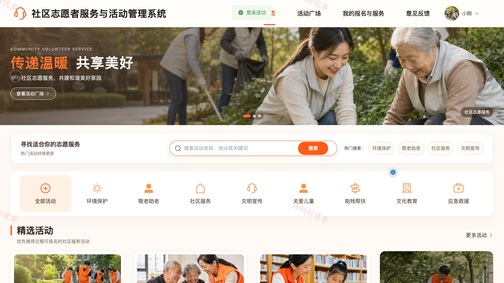
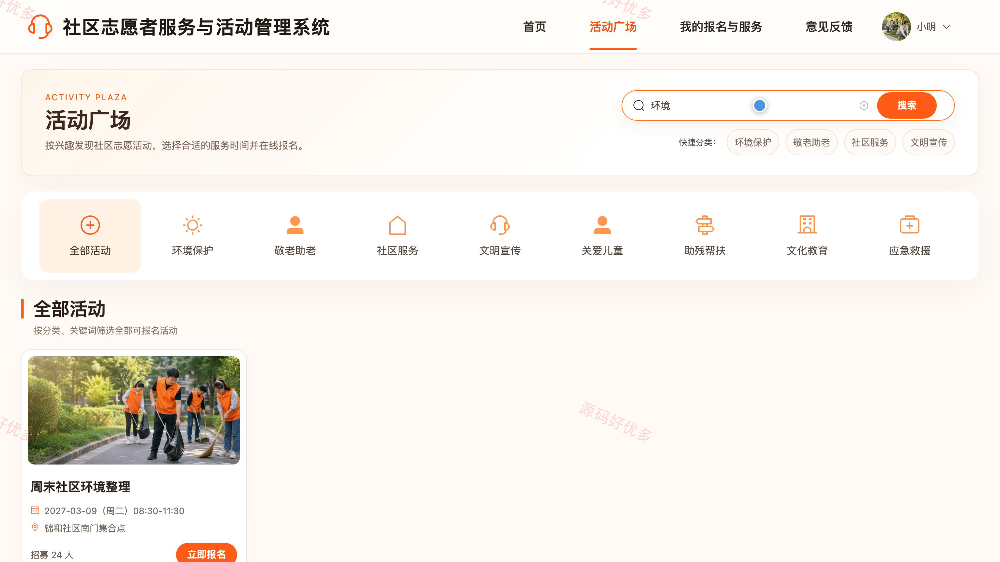
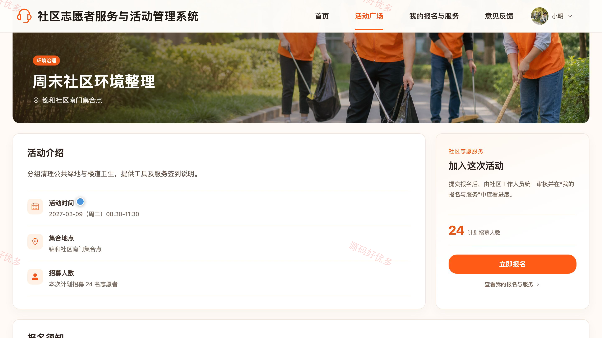
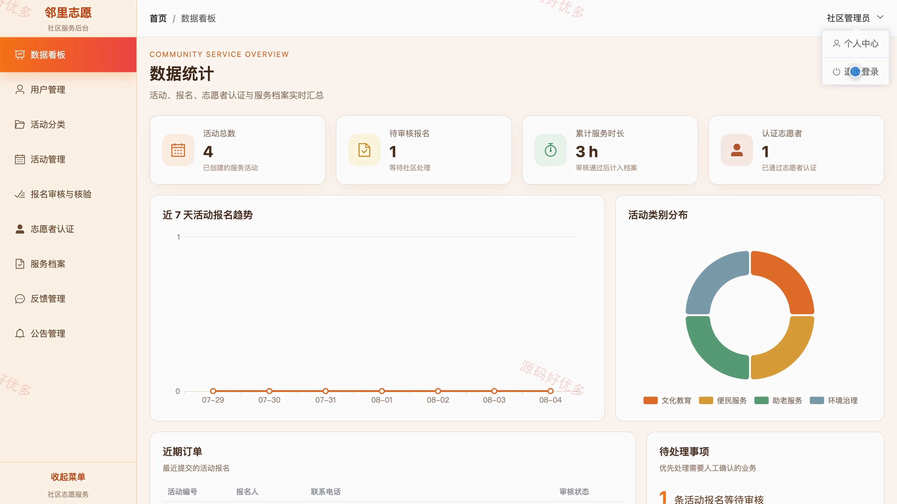
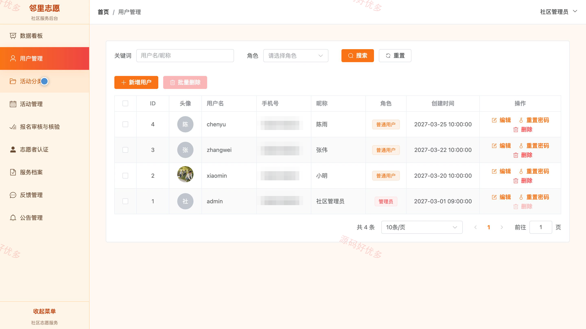
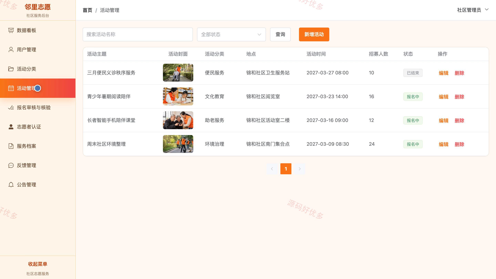

## 源码问题查看主页咨询

### 一、关键词
社区志愿服务、公益活动、志愿者管理、活动报名、服务时长

### 二、作品包含
源码+数据库+全套环境和工具资源+本地部署教程

### 三、项目技术
前端技术： Html、Css、Js、Vue3.4、Element-Plus
后端技术：Java、SpringBoot3.2.0、MyBatis-Plus

### 四、运行环境（以下版本亲测，其他版本兼容性请自行测试）
开发工具：IDEA/eclipse + VSCODE

数据库：MySQL5.7+（共11张表）

数据库管理工具：Navicat10以上版本

环境配置软件： JDK17 + Maven3.6.3

前端Nodejs：16+

浏览器：谷歌浏览器

### 五、项目介绍
项目编号：bs019A

系统面向社区居民、志愿者和社区管理人员，打通志愿活动发布、在线报名、参与核验、工时申报、服务档案和意见反馈等业务环节。用户可查看社区公告与志愿活动，完成报名、志愿者认证、服务工时申报及反馈；管理员负责用户、活动、报名、认证、服务档案和公告等内容的审核与维护，并通过数据看板掌握活动开展情况。

角色：用户、管理员

用户功能：公告查看、志愿活动浏览、活动报名、报名记录查询、志愿者认证申请、服务工时申报、个人服务档案、意见反馈。

管理员功能：数据统计、用户管理、活动分类管理、志愿活动管理、报名审核与参与核验、志愿者认证审核、服务档案审核、反馈与公告管理。

### 六、运行截图

